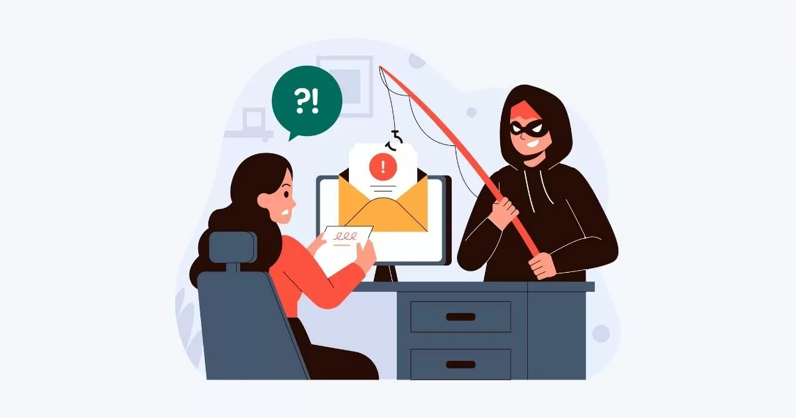

# Fraud

## Fraud Nedir?

Fraud Detection konusunu ele almadan önce ilk başta Fraud kavramını açıklığa kavuşturmakta yarar var. Fraud, yani dolandırıcılık, bir kişiyi veya kuruluşu aldatmak, haksız kazanç sağlamak ya da maddi çıkar elde etmek amacıyla gerçekleştirilen kasıtlı ve yasa dışı bir eylemdir. Asıl amaç, bir mal varlığını, parayı, hizmeti veya bir başka değeri haksız bir şekilde ele geçirmektir.

## Fraud Çeşitleri Nelerdir?

Fraud karşımıza sayılmayacak çok türde ve sürekli şekil değiştirerek çıkmaktadır. Daha kapsamlı olmak adına genel hatları ve ortak paydaları çerçevesinde aşağıdaki gibi sınıflandırılabilir.

1. **Finansal Dolandırıcılık:** Kredi kartı dolandırıcılığı, sahte banka işlemleri.
2. **Kimlik Hırsızlığı:** Başkalarının kimlik bilgilerini kullanarak sahte işlemler yapmak.
3. **Yatırım Dolandırıcılığı:** Yatırımcılara sahte vaatlerle para toplamak.
4. **Sigorta Dolandırıcılığı:** Sahte hasar talepleriyle sigorta şirketlerini aldatmak.

***


Genel korunma tavsiyesi olarak dolandırıcılık türlerini öğrenmek ve nasıl çalıştıklarını anlamak sizi büyük ölçüde korur. Dolandırıcılık kurbanı olduğunuzu biliyor veya düşünüyorsanız hızlı bir şekilde aksiyon alıp zaman kaybetmeden yetkili kişi ve kuruluşlara gerekli bilgilendirmeyi en kısa sürede yapmanız mağduriyetinizi önemli ölçece azaltacaktır.


***

<figure><figcaption></figcaption></figure>

***

## Fraud ve Phising

Phising Fraud'un bir alt türü olarak kabul edilse bile dolandırıcılıkların büyük bir çoğunluğuna sebep olduğundan dolayı ayrı bir başlık altında inceleyip korunma yöntemleri hakkında bilgilenmek yaralı olacaktır

Phishing saldırıları, kullanıcı adları, şifreler, kredi kartı bilgileri ve ağ kimlikleri gibi hassas verilere ulaşmak amacıyla gerçekleştirilen saldırılardır. Siber saldırganlar, telefon veya e-posta aracılığıyla normal bir birey veya kuruluş gibi görünerek mağdurları belirli eylemler (zararlı bağlantılara veya ek dosyalara tıklama gibi) yapmaya veya gizli bilgilerini açıklamaya zorlamak için sosyal mühendislik teknikleri kullanırlar.

Phishing saldırılarından korunmak için bu tür saldırıların farkında olmak önemlidir. İlişkide olduğunuz hiçbir kurum veya kuruluşun e-posta yoluyla şifre veya kişisel bilgilerinizi talep etmeyeceğini bilmek, bu tür dolandırıcılıklardan korunmanıza yardımcı olacaktır.

<figure><figcaption></figcaption></figure>

***

## Frauddan Nasıl Korunmalıyız?


Edinmemiz Gereken Bilgiler

[HTTPS sertifikası](#user-content-fn-1)[^1]  giriş yaptığımız web sitelerinde adres çubuğunun ilk karakterlerinde görüntülenebilir, (bkz. [https://yildizcti.com\
](https://yildizcti.com))

SSL sertifikası ise bir web sunucusunun kimliğini doğrulayan ve verilerin güvenli bir şekilde iletilmesini sağlayan bir dijital belgedir.



<strong>Kimlik Hırsızlığına Karşı Korunma</strong>

* Güçlü Şifreler Kullanmak:Her hesap için güçlü, benzersiz şifreler kullanmak kritik önem taşır.

<!---->

* İki Faktörlü Kimlik Doğrulama (2FA):  2FA sayesinde şifre veya şifreleriniz kötü niyetli tarafların eline geçse bile direkt olarak erişim mümkün olmayacaktır.&#x20;

<!---->

* Kişisel Bilgilerinizi Paylaşmayın: Sosyal medya ve çevrimiçi platformlarda kimlik bilgilerinizi paylaşırken dikkatli olun. Doğum tarihi, adres, telefon numarası gibi bilgilerinizi mümkün olduğunca gizli tutun.

<strong>Finansal Dolandırıcılığa Karşı Korunma</strong>

* **Güvenli Alışveriş**: Yalnızca güvendiğiniz sitelerden alışveriş yapın, giriş sağladığınız sitede her zaman HTTPS  protokülünün kullanıldığından emin olun.

<!---->

* **Kredi Kartı Hareketlerini Takip Etmek:** Banka ve kredi kartı hesap hareketlerinizi düzenli olarak kontrol edin. Şüpheli işlemleri hemen bankaya bildirin.

<strong>Siber Dolandırıcılığa Karşı Korunma</strong>

* **Şüpheli E-postalara Dikkat Etmek:** Tanımadığınız kişilerden gelen e-postaları açmadan önce dikkatli olun ve e-postalardaki bağlantılara tıklamadan önce iki kez düşünün.
* **Güncel sürümleri kullanmak**: İşletim sistemi ve yazılımlarınızı güncellemeyi unutmayın. Çeşitli zaafiyetler devamlı keşfediliyor ve bunun üzerine kullandığımız ürünler gereklilik doğrultusunda yamalar yaparak kullanıcıların mağdur olmasını engelliyor

<strong>Yatırım Dolandırıcılığına Karşı Korunma</strong>

* Yatırım yapmadan önce çok dikkatli araştırma yapın.

<!---->

* Yatırım yapacağınız finansal kurumların yetkili düzenleyici kurumlar tarafından denetlendiğinden emin olun.

***

<figure><figcaption></figcaption></figure>

## Çözümün Bir Parçası Olun

Günlük hayatınızda karşılaştığınız dolandırıcılık ve kötü niyet içeren web sitelerini [**USOM**](https://www.usom.gov.tr/iletisim) adresi üzerinden ilgili kurumlara iletmek, yetkililerin bu konuda aksiyon almasını hızlandırmak açısından büyük önem taşır. Bu tür bildirimler, siber güvenlik alanında toplumsal bir farkındalık yaratmakla kalmaz, aynı zamanda bireysel olarak siber güvenlik inisiyatifinizi de ortaya koymanızı sağlar. Unutmayın ki, her bireyin bu tür tehditlerle mücadelede üzerindeki sorumluluklar büyüktür; böylece birlikte daha güvenli bir dijital ortam oluşturma yolunda önemli bir adım atmış olursunuz. Teşekkürler.

Bu yazı Yılmaz Poyraz Arsu tarafından hazırlanmıştır.

[^1]: 

    HTTPS, web üzerindeki veri iletimini güvence altına alan bir protokoldür. HTTP'nin güvenli bir versiyonudur ve amacı sunucu ile kullanıcı arasındaki iletilen verilerin gizliliğini ve bütünlüğünü korumaktır.
